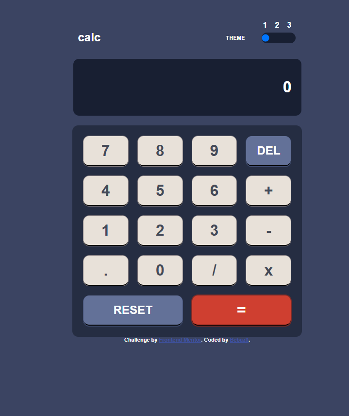

# Frontend Mentor - Calculator app solution

This is a solution to the [Calculator app challenge on Frontend Mentor](https://www.frontendmentor.io/challenges/calculator-app-9lteq5N29). Frontend Mentor challenges help you improve your coding skills by building realistic projects. 

## Table of contents

- [Overview](#overview)
  - [The challenge](#the-challenge)
  - [Screenshot](#screenshot)
  - [Links](#links)
- [My process](#my-process)
  - [Built with](#built-with)
  - [What I learned](#what-i-learned)
  - [Continued development](#continued-development)
- [Author](#author)


## Overview

### The challenge

Users should be able to:

- See the size of the elements adjust based on their device's screen size
- Perform mathmatical operations like addition, subtraction, multiplication, and division
- Adjust the color theme based on their preference
- **Bonus**: Have their initial theme preference checked using `prefers-color-scheme` and have any additional changes saved in the browser

### Screenshot



### Links

- Live Site URL: [https://bebaz0.github.io/calculator-app-main/](https://your-live-site-url.com)


### Built with

- Semantic HTML5 markup
- CSS custom properties
- CSS Grid

### My process

### What I learned

Didnt really know that i could store data in the css as variables so thats cool. I also used divide and conquer to
break down the script.


```css
:root {
  --primary-color: hsl(222, 26%, 31%);
  --secondary-color: hsl(223, 31%, 20%);
  --accent-color: hsl(6, 63%, 50%);
  --text-color: hsl(0, 0%, 100%);
}
```
```js
document.addEventListener('DOMContentLoaded', () => {
  new CalculatorApp();
  console.log("Calculator App Initialized");
});
```

### Continued development

Still need to work on the bonus feature of saving the theme preference in the browser. If someone has any tips for me
about that, please let me know!

## Author

- Website - [https://github.com/Bebaz0](https://www.your-site.com)
- Frontend Mentor - [@Bebaz0](https://www.frontendmentor.io/profile/yourusername)
- Gmail - limaafonso57@gmail.com

